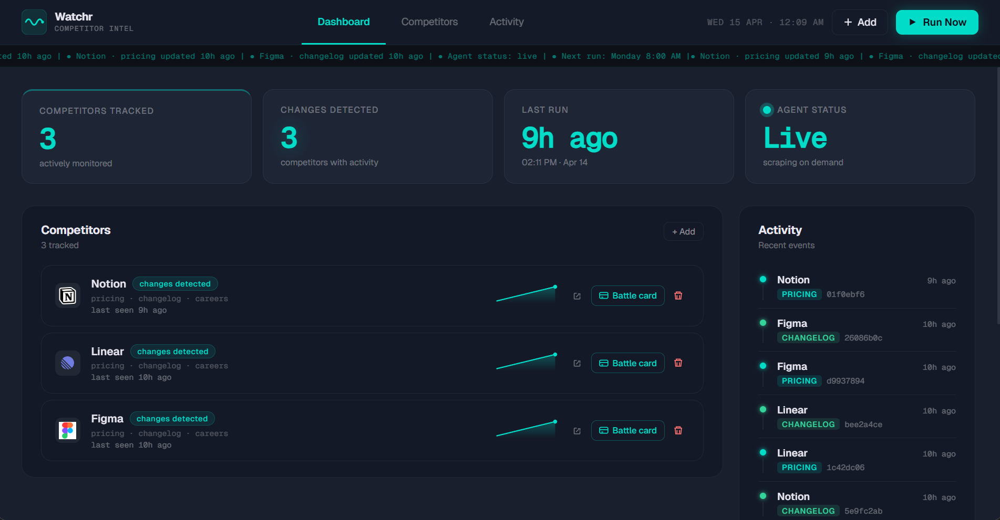

# Watchr — Competitor Intelligence Agent

Autonomous competitive intelligence platform that monitors competitor pricing, changelogs, and hiring pages — uses Claude AI to detect meaningful changes and delivers structured Slack digests with battle card generation.



---

## Features

- **Automated scraping with Playwright** — headless browser crawls competitor pricing, changelog, and careers pages on a configurable schedule, bypassing basic bot detection
- **AI-powered change detection via Claude API** — diffs raw HTML snapshots and uses Claude to distinguish meaningful product changes from noise (layout tweaks, cookie banners, etc.)
- **Immediate high-severity Slack alerts** — pricing changes and major product announcements trigger instant notifications without waiting for the weekly digest
- **Weekly Slack digest** — structured summary of all competitor movements across the week, grouped by company and severity
- **Hiring signal tracker** — monitors careers pages for new job postings and headcount shifts, surfacing team growth signals before they become public knowledge
- **One-click battle card PDF generator** — generates a structured competitive analysis document per competitor using Claude, exported as a ready-to-share PDF
- **React dashboard with live ticker** — real-time web UI showing competitor cards, activity feed, stat cards, and a scrolling event ticker; includes Google favicon logos and sparkline activity charts

---

## Tech Stack

| Layer | Technology |
|---|---|
| Scraping | Python 3.14 + Playwright (Chromium) |
| Backend API | Flask |
| AI | Claude API (`claude-sonnet-4-20250514`) |
| Frontend | React + Vite |
| Database | SQLite |
| Notifications | Slack Webhooks |
| PDF Generation | ReportLab |

---

## Project Structure

```
competitor-watcher/
├── app.py               # Flask API server — competitors, activity, run endpoints
├── scraper.py           # Playwright scraper — crawls URLs and stores snapshots
├── differ.py            # HTML diffing — extracts meaningful text changes between snapshots
├── summarizer.py        # Claude integration — classifies changes and writes summaries
├── reporter.py          # Digest builder — formats and posts weekly Slack reports
├── alerts.py            # High-severity alerting — immediate Slack pings for critical changes
├── battlecard.py        # Battle card generator — Claude-powered PDF competitive briefs
├── database.py          # SQLite schema and query helpers
├── competitors.yaml     # Competitor config — names, URLs, scrape schedule
├── start.bat            # One-command launcher — starts Flask + Vite dev server
├── requirements.txt     # Python dependencies
└── frontend/
    ├── src/
    │   ├── App.jsx      # Main React app — dashboard, competitors table, activity feed
    │   └── main.jsx     # Vite entry point
    └── package.json
```

---

## Setup

**1. Clone the repository**
```bash
git clone https://github.com/yourname/competitor-watcher.git
cd competitor-watcher
```

**2. Create and activate a Python virtual environment**
```bash
python -m venv venv

# Windows
venv\Scripts\activate

# macOS / Linux
source venv/bin/activate
```

**3. Install Python dependencies**
```bash
pip install -r requirements.txt
```

**4. Install Playwright browser**
```bash
playwright install chromium
```

**5. Configure environment variables**
```bash
cp .env.example .env
# Open .env and fill in your API keys
```

**6. Install frontend dependencies**
```bash
cd frontend
npm install
```

---

## Usage

### Start the full dashboard

From the project root on Windows:
```bat
start.bat
```

This launches the Flask API on `http://localhost:5000` and the Vite dev server on `http://localhost:5173` in parallel.

### Run the scraper manually

```bash
# Crawl all competitor URLs and store snapshots
python scraper.py

# Generate and post the Slack digest
python reporter.py
```

### API endpoints

| Method | Endpoint | Description |
|---|---|---|
| `GET` | `/api/competitors` | List all tracked competitors |
| `POST` | `/api/competitors` | Add a new competitor |
| `DELETE` | `/api/competitors/<name>` | Remove a competitor |
| `GET` | `/api/activity` | Recent scrape events |
| `POST` | `/api/run` | Trigger a manual scrape run |
| `POST` | `/api/battlecard/<name>` | Generate and download a battle card PDF |

---

## Environment Variables

| Variable | Description |
|---|---|
| `ANTHROPIC_API_KEY` | Anthropic API key for Claude change detection and battle card generation |
| `SLACK_WEBHOOK_URL` | Incoming webhook URL for digest and alert delivery |

---

## License

MIT
